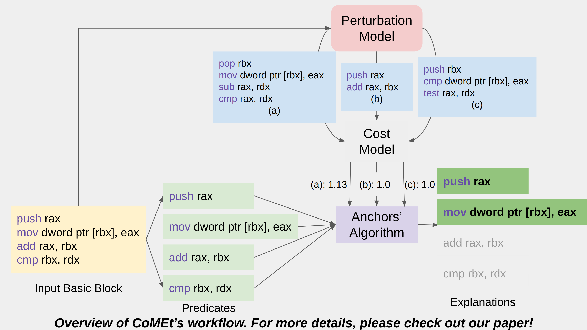

# CoMEt: Cost-Model-Explanations




CoMEt is a framework for explaining performance predictions given by x86 assembly cost models. CoMEt can be used to identify the instructions of the input basic block which are important for the throughput prediction made by the cost model being explained. CoMEt is compatible with any x86 assembly input basic block and is optimized to explain throughput predictions. In this implementation, we provide functionalities to explain the cost models [Ithemal](https://github.com/ithemal/Ithemal) and [uiCA](https://github.com/andreas-abel/uiCA) with CoMEt. Note that CoMEt is compatible with other cost models as well, with minor adjustments. 
CoMEt explanations can also be generated at the token-level as well, i.e. CoMEt will identify the tokens (opcodes and operands) in the input basic block which are important for the throughput prediction. 

For more details on CoMEt's algorithms, please check out our [paper](https://arxiv.org/abs/2302.06836).

## Setup instructions

[//]: # (CoMEt can be set up using two possible setup options, with &#40;recommended&#41; and without the use of Docker.)

[//]: # ()
[//]: # (### Setup using Docker)

[//]: # (If one chooses to use Docker to setup CoMEt, one needs to ensure that Docker is installed on the machine running the experiments. More details on installing Docker can be found at https://docs.docker.com/get-docker/. After installation of Docker, one just needs to run the following set of commands from the project's root directory. )

[//]: # (```)

[//]: # (cd docker/)

[//]: # (sudo docker build -t comet ../)

[//]: # (cd ../)

[//]: # (```)

[//]: # ()
[//]: # (### Setup without Docker)

[//]: # (If one chooses the setup option without Docker, then one must ensure the following requirements.)
The following minimal requirements exist for setting up CoMEt. 
- Ubuntu OS (the experiments in the paper were conducted on Ubuntu v22.04, so it is recommended to work with a recent distribution of Ubuntu)
- `sudo` access on the machine on which experiments are conducted
- `python, pip, miniconda, cmake` must be installed on the machine
- [LLVM](https://llvm.org/) must be installed on the machine. To install `LLVM`, run `sudo apt install llvm`

Once the above requirements are satisfied, CoMEt can be setup by running the following commands from the project's root directory. 

```
./scripts/setupcomet.sh
eval "$(conda shell.bash hook)"
conda activate comet
```

This is a one-time installation procedure. When re-running CoMEt after installation, one should just activate the environment of the project by `conda activate comet` before running any experiments. 

## Creating CoMEt's explanations for one basic block
To explain one input x86 assembly basic block using CoMEt, one needs to run the following command. 

```python3 explainOneBasicBlock.py <your code> <cost model>```

Optional arguments to above command:
- `-token`: to explain the throughput predictions of the cost model at the token-level of the input basic block.
- `-threshold`: to specify custom precision threshold $(1-\delta)$ for the Anchors' algorithm (default = 0.82)
- `-probability`: to specify custom probability parameter for the probability mass function in the perturbation model (default = 0.5)
- `-verbose`: to get more detailed output.

An example invocation of CoMEt on one basic block is shown below. 

```
python3 explainOneBasicBlock.py 'push rax; mov dword ptr [rbx], eax; add rax, rbx; cmp rbx, rdx' ithemal -threshold 0.82 -probability 0.5
```

For the above command, the expected output is given below. 
```
The basic block being explained is:
push rax
mov dword ptr [rbx], eax
add rax, rbx
cmp rbx, rdx

Testing cost model Ithemal

Throughput Prediction for input basic block made by model ithemal: 2.0355498790740967
All predicates to explain with are characterized by instruction:  ['inst_0', 'inst_1', 'inst_2', 'inst_3']

Creating CoMEt's explanations for the input basic block...

Total time taken for creating explanations with instruction predicate: 93.90899753570557

====================================================================================================
Predicate type:  instruction
CoMEt's explanation consists of predicates corresponding to: inst_0 AND inst_1
Precision: 0.99
Coverage: 0.08
====================================================================================================
```
In the above output, the `inst_<i>` means the instruction indexed by `i`, with 0-indexing. 

The currently supported cost models in CoMEt are Ithemal (cost model name for command: _ithemal_) and uiCA (cost model name for command: _uica_). If one wants to add another cost model to create CoMEt explanations for, then please follow the details in [the section on adding a new cost model](##adding-a-new-cost-model). 
The default cost model for which CoMEt generates explanations is _Ithemal_. 

The explanations take time in the order of minutes to be created on average, for basic blocks with number of instructions between 4 and 10. 

<!-- ## Reproducing the experiments in the paper. -->


## Adding a new cost model
If you want to get CoMEt's explanations for a cost model that is not yet supported in this implementation (we currently support Ithemal and uiCA only), you need to make minor changes in the file `models/testing_models.py`. This file contains the functions which invoke various cost models. In order to add your cost model, edit the template function provided in the aforementioned file. You will need a helper function which will return the prediction made by your cost model for one input basic block. Please refer to the template for more guidance. After editing the `models/testing_models.py` file, you will need to add support for your cost model's name in the command line arguments shown in the sample invocation above. In case you face any trouble introducing a new cost, please create an issue and we will help you asap. 

## How to cite?
Thank you for your interest in CoMEt. If you use this work in your own research, please cite our paper. Thanks!
```
Chaudhary, Isha & Renda, Alex & Mendis, Charith & Singh, Gagandeep. (2023). CoMEt: x86 Cost Model Explanation Framework. 10.48550/arXiv.2302.06836. 
```

## Contact
For any comments or feedback, please email at isha4@illinois.edu.
